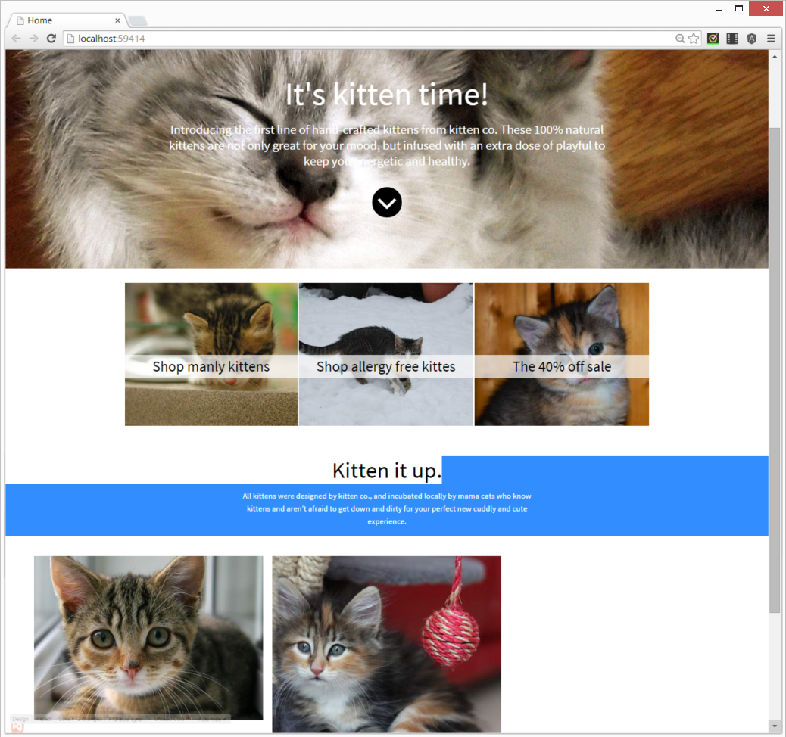
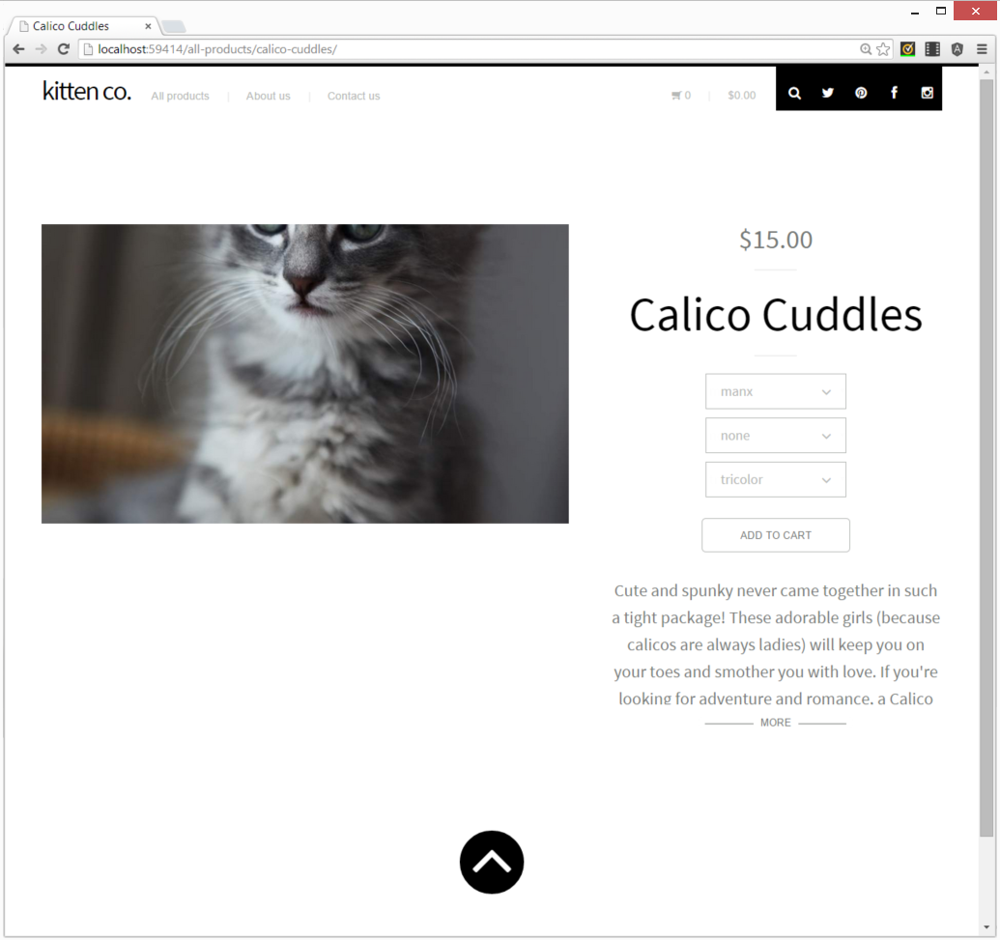
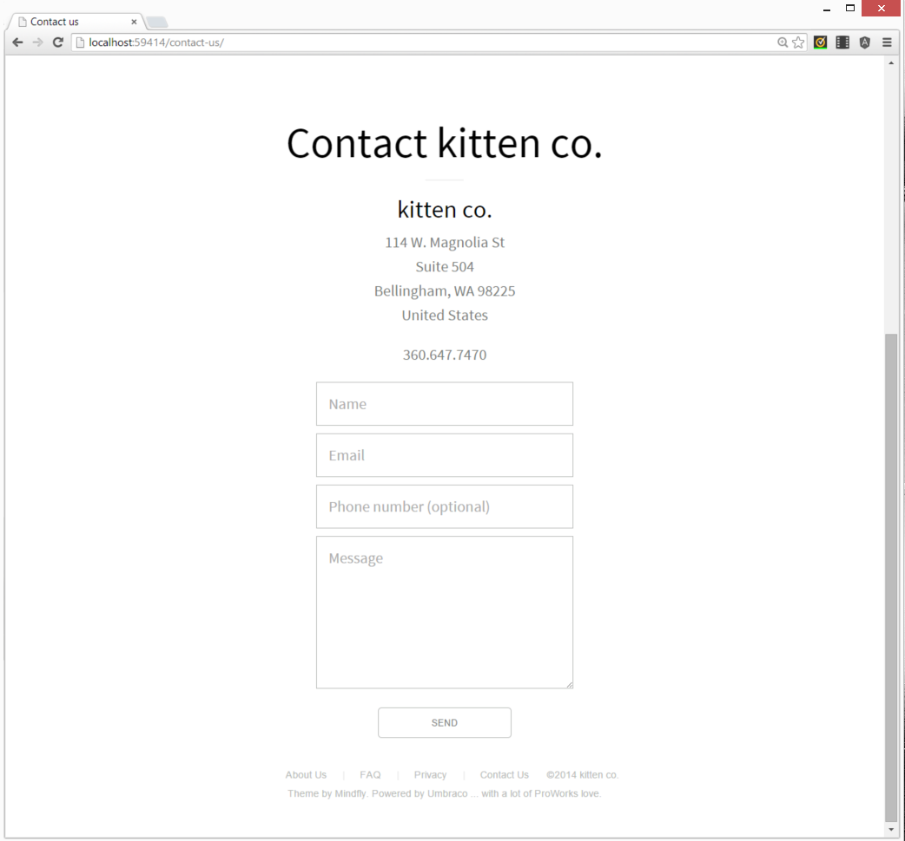
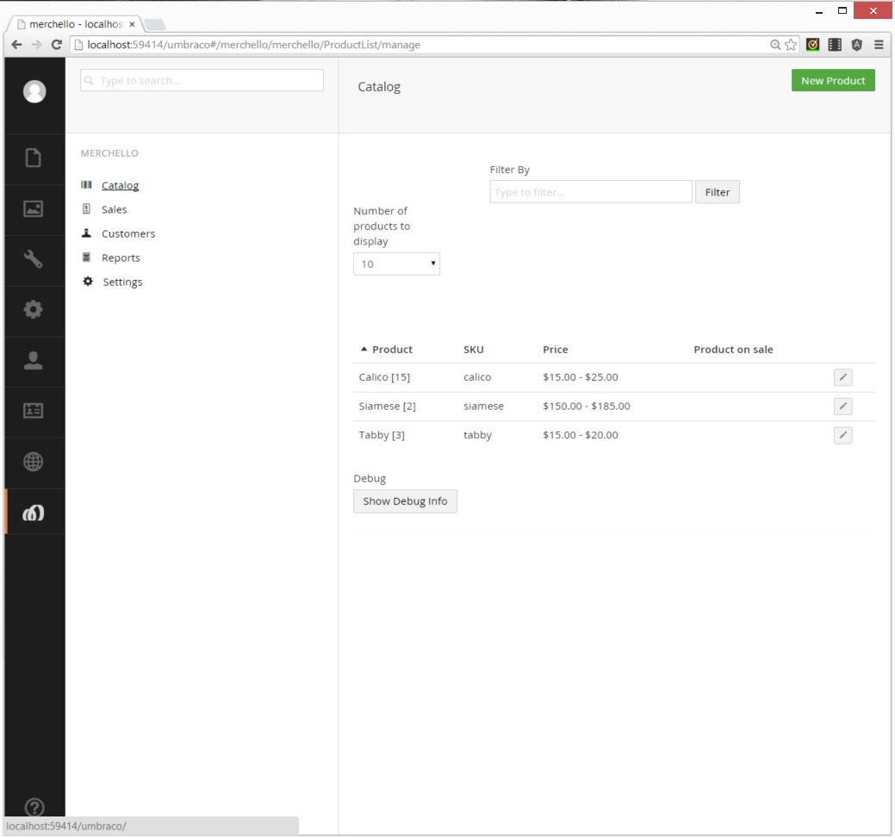
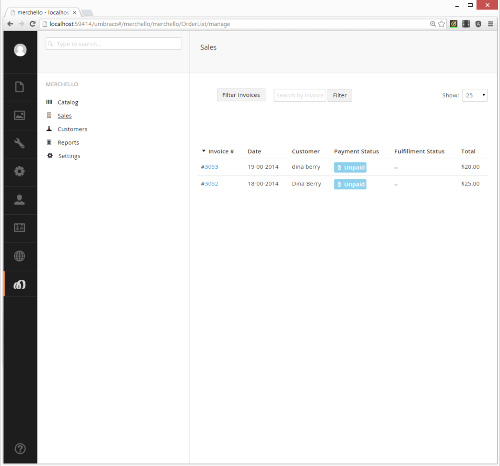
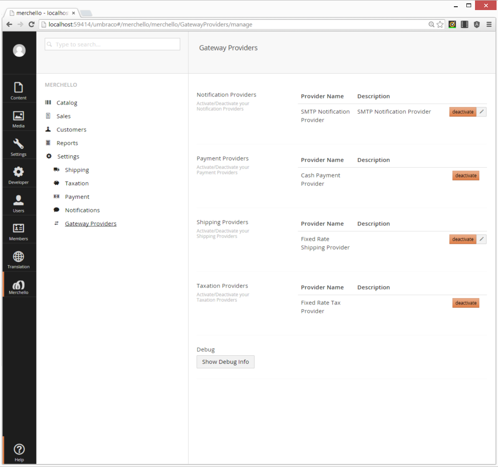
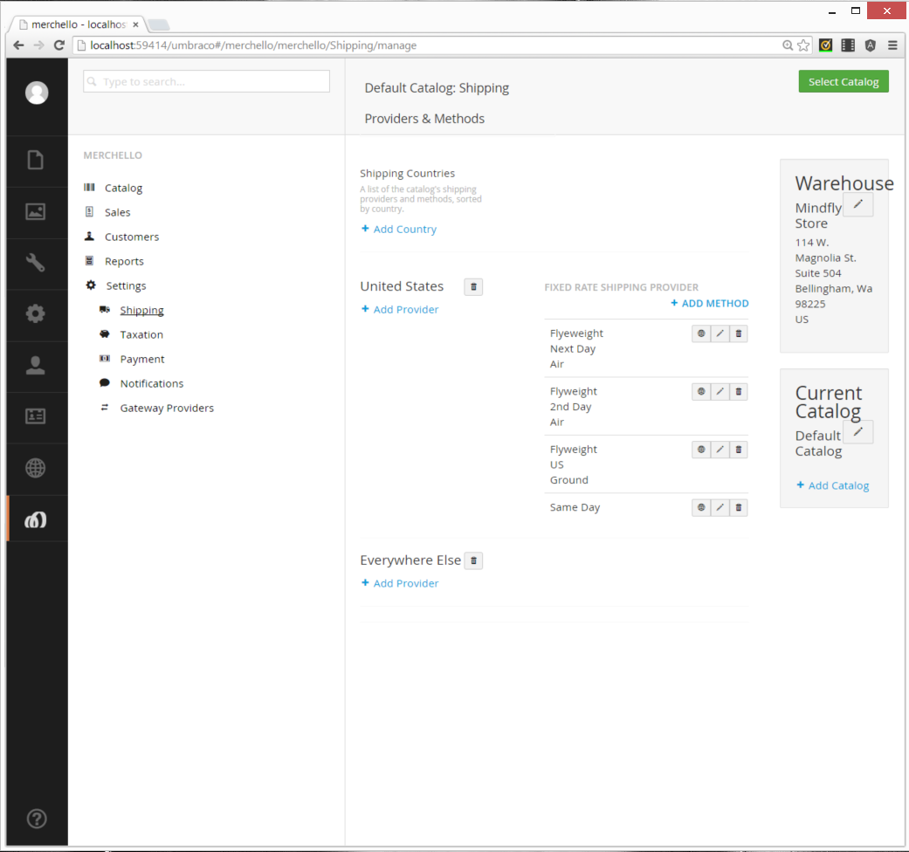

Samples and Starter Kit
=======

These projects are samples of using Merchello Commerce services. 

Kitten
user:admin
pwd: 1234

##How-Tos
The how-to projects are meant to be very small - showing you a very specific task or feature. Please read the associated how-to article at [merchello.com](http://merchello.com/documentation/getting-started/how-to/).

##Kitten Starter
The Kitten site is the beginning of a great starter kit. The site features product selection with options, a basket/shopping cart, and a checkout process. Feel free to take the starter as a beginning site. Or look at the code as an example of what you can do with Merchello. 

###Kitten Home Page

###Kitten Product Page

###Kitten Contact Us Page

###Kitten Back Office Product List

###Kitten Back Office Sales List

###Kitten Back Office 3rd Party Gateways

###Kitten Back Office Shipping Gateway

